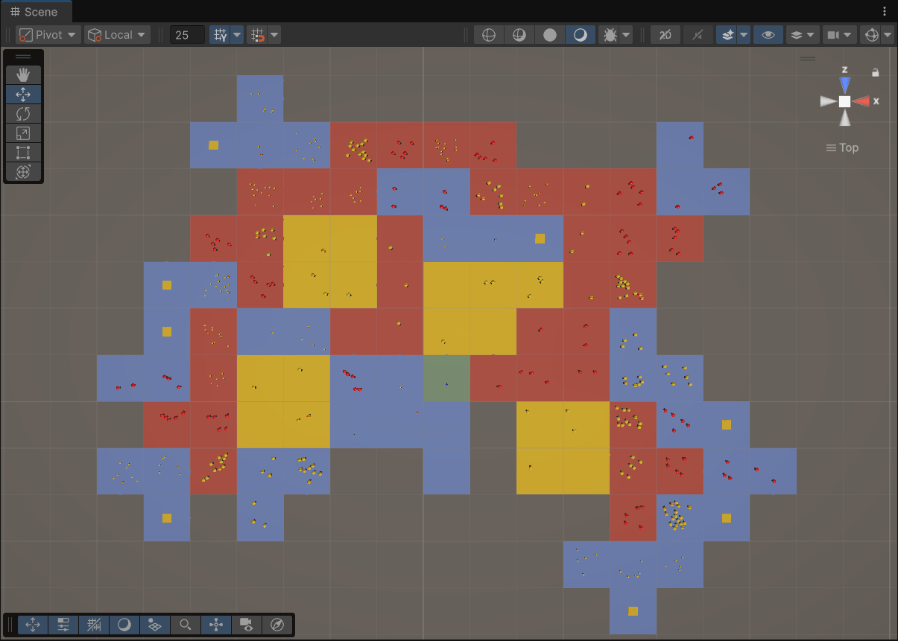
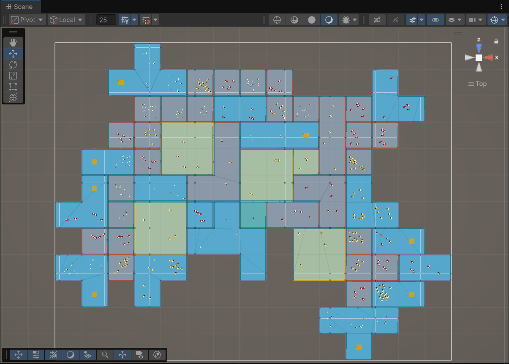

*Altough the projects algorithm is already completed the demo scene is still pending, once that is completed a working built will be released on the Unity asset store! Please note the current prefabs available in the project won't work in your project!*

# Infinite Procedural Dungeon Generator (Scriptable Objects)
This is my first public open-source project. Feedback on code quality or structure is very welcome.
This project provides an infinite procedural dungeon generator for Unity using ScriptableObjects. It is designed to make procedural dungeons quickly accessible for demos, prototypes, tests, and beginner projects. A demo scene is included with a simple first-person shooter application to show its capabilities.## Foreword
Infinite level generation normally requires a lot of setup and logic, even for basic implementations. This asset aims to remove that barrier by providing a complete, configurable generator that can be used immediately or customized through ScriptableObjects.
A working demo scene is included if you want to quickly test the system or have an example to built from.## Setup and Implementation
Below is the required setup. Clarity feedback is appreciated.

Here an example of generator:
- It starts with a normal generation until wave: 15
- Then between wave: 15 and 40 it will only spawn 1x1 red rooms.
- After wave 40 it will only spawn blue rooms in cross gen mode.

*These pictures are made in debug mode with useBatchSpawning enbabled*

## Setup & Implementation
### 1. Add the DungeonManager to Your Scene
Because this generator creates infinite layouts, it is recommended to start with an empty scene.
Drag the DungeonManager prefab into the scene.
The asset includes the default demo configuration and will generate a functional infinite dungeon as soon as you press Play when added to the DungeonManager. You can adjust parameters afterward.
The DungeonManager also contains a NavMeshSurface component that will dynamically update the Surface, you can delete this if you don't need it!

#### DungeonManager settings
| Property | Type | Default | Description |
|----------|------|---------|-------------|
| **dSDList** | `List<DungeonSettingsData>` | - | List of dungeon settings data entries. Each entry contains configuration for room generation, enemy spawns, and other dungeon parameters. They can be cycled through as the dungeon grows bigger|
| **RoomSize** | int | 25 | Size of each room in world units. Determines spacing and placement of rooms in the dungeon grid. |

### 2. Prepare Your ScriptableObjects
The system relies on three ScriptableObject types:

#### DungeonDataSettings
- Contains all dungeon-wide parameters, references, room & enemy collections and generator rules.
- Replacing this ScriptableObject gives you a completely new dungeon configuration.

#### RoomSpawnData
- Defines an individual room type.
- Includes the room prefab and all room-specific settings.
- More on creating a correct room prefab later.

#### EnemySpawnData
- Defines an enemy type.
- Contains the enemy prefab, the DungeonEnemyScript, and all enemy-specific settings.
- Enemies can be made however you like, this ScriptableObject only helps with spawning in enemies!

*Note: If anyone has a clean architectural idea for linking RoomDataObjects and EnemyDataObjects under unified spawn conditions (for example: “this room only spawns this enemy” or “this enemy appears only in this room”) without writing dozens of if statements.) Please let me know!*

### 3. Adding Your Own Rooms
Adding rooms involves assembling the required components, configuring them, and registering the room so it can be used by the dungeon algorithm.

#### Required Room Components
Each room prefab should include the following:

| Component           | Notes                                                                 |
|--------------------|----------------------------------------------------------------------|
| **Floor**           | Single floor piece.                                                   |
| **Wall**            | One wall piece. Edges must match with other rooms for proper alignment. |
| **Gate / Doorwall** | Wall with a built-in gate or passage.                                 |
| **Door**            | Functional door that opens and closes the gate.                       |
| **Ceiling**         | Optional, required for first-person but not for top-down view.       |

#### Other Components
Each room can optionally include the following:

| Component           | Notes                                                                 |
|--------------------|----------------------------------------------------------------------|
| **Loot Chest**      | A prefab that functions as your loot chest.                           |
| **Enemy**           | Prefab with the DungeonEnemy script attached.                         |

More detailed explanation on prefab setup coming soon...

*Note: I’m curious if it would be viable to have a room as scriptableObjects and then assembled in code, just add: floor, wall, doorwalls, door and code assembles it. Sounds sick I might get to that after my thesis! It would be a great way to make rooms have more dynamic possibilities!*
## Scriptable Object settings

### DungeonSettingsData
| Property | Type | Default | Description |
|----------|------|---------|-------------|
| **takeOverAtWave** | int | 0 | The wave number at which this DungeonSettingsData takes control. Useful for progressive difficulty and changing things over time the deeper you go. |
| **enemySpawnData** | List<EnemySpawnData> | - | List of enemy spawn configurations for this DungeonSettingsData. Each entry defines enemy type, count, and spawn rules. |
| **roomSpawnData** | List<RoomSpawnData> | - | List of room spawn configurations. Each entry defines room type, placement rules, and any special attributes. |
| **generalLootChest** | GameObject | - | Prefab for a general loot chest that can spawn in rooms. (This is a default, each individual RoomSpawnData can have its own chest) |
| **doorSpawnChance** | float (0–1) | 0.5 | Chance that a door will spawn at any potential direction. 0 = never, 1 = always. |
| **enemySpawnMargin** | float | 5f | Minimum distance between enemies and the outer edges of the room. |
| **roomChainLikelyhood** | float (0–0.95) | 0.5 | Likelihood that a room will expand itself |
| **extendedRoomChainLikelyhood** | float (0–0.95) | 0.3 | Likelihood for an expanded room to expand itself even further |
| **chancePerDirection** | float (0–0.95) | 0.5 | When a room is flagged to be expanding how much chance does each side has to spawn an expansion. |
| **lootRoomAppearanceChance** | float (0–0.95) | 0.2 | Chance that a loot chest will spawn in an expanded room. |
| **lootRoomCooldown** | int | 2 | Number of rooms have to be spawned before another loot room can spawn. |
| **crossGenMode** | bool | false | Enables cross-generation mode, in cross gen mode the algorithm will always try to spawn rooms in a cross format. |
| **debugMode** | bool | false | Enables debug properties for testing. |
| **useStaticSeed** | bool | true | Determines whether a static seed is used for dungeon generation so you can test and debug. |
| **seed** | int | 311625 | The seed used for random generation when `useStaticSeed` is true. |
| **useBatchSpawning** | bool | true | Enables batch spawning of rooms and enemies, rooms will spawn automatically as if they are triggered by the player. |
| **debugRoomCount** | int (0–100) | 50 | Number of rooms to spawn in debug mode when batch spawning is active. |
| **roomSize** | float | 25f | Size of each room in world units. Editable only in `DungeonManager`. |

### RoomSpawnData
| Property | Type | Default | Description |
|----------|------|---------|-------------|
| **roomObject** | DungeonRoom | - | Reference to the room prefab |
| **specificEnemy** | EnemySpawnData | - | You can spawn only a specific enemy in this room if you so desire. |
| **maxCooldown** | int | 1 | Maximum cooldown in spawned rooms before this room can spawn again. |
| **is1x1** | bool | false | Forces the room to always be 1x1. |
| **is2x2** | bool | false | Forces the room to always be 2x2. |
| **isLootRoom** | bool | false | Marks the room as a loot room, which may spawn special chests or rewards. Loot rooms won't spawn enemies |
| **canHaveLootroomInSecondarySpawn** | bool | true | Determines if a loot room is allowed to spawn in this room at any point. |
| **specificLootChest** | GameObject | - | If you want an unique loot chest for this specific room. |
| **roomLocks** | bool | true | If true this room will close the doors behind you when you enter. |

### EnemySpawnData
| Property | Type | Default | Description |
|----------|------|---------|-------------|
| **enemyObject** | DungeonEnemy | - | Reference to the enemy prefab that this configuration spawns. |
| **spawnWeight** | int | 1 | Enemies are spawned based on how deep you are in the dungeon, if you are 8 waves in and the weight is 4: 2 enemies can be spawned. When its wave 10 and there is a weight of 6 only 1 will be spawn. |
| **minWave** | int | 0 | Minimum wave in which this enemy can appear. |
| **maxWave** | int | int.MaxValue | Maximum wave in which this enemy can appear. |
| **minCount** | int | 1 | Minimum number of this enemy to spawn per batch. (This will ignore weight if you and enforce the minimum) |
| **maxCount** | int | int.MaxValue | Maximum number of this enemy to spawn per batch.  (This will ignore weight if you and enforce the maximum) |
| **spawnInterval** | int | 0 | Waves that need to be between when this enemy spawned and when it has a chance to spawn again. |
| **isCentered** | bool | false | If true, this enemy will always spawn in the center of the room its assigned too. |
| **difficultyMultiplier** | float | 1f | Multiplier applied to scale this enemy’s stats. When making your enemy you can call this multiplier through `GetComponent<DungeonEnemy>().GetDifficultyIncrement();` this value is multiplied by the amount of rooms. If you have 100 health and you multiply it by DifficultyIncrement on `Start()` at wave 10 your enemy will have 1000 health. |

## POTENTIAL future plans
*After this project is officially out there I want to go back to focussing on school and release some other free assets but if I come back to this or someone is looking to contribute to this project, have a look!*
- I want room creation to be less messy
- Mixing enemies in dungeons
